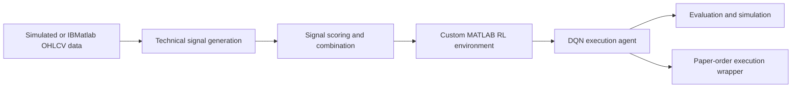

# IBMatlab RL Trading System

MATLAB research project for an automated trading workflow using IBMatlab data hooks, technical signal ranking, reinforcement-learning execution logic, and paper-order submission wrappers for Interactive Brokers TWS.

This repository is organized from a coursework project. It is intended for education and research only. It is not investment advice and should not be used for live trading without independent review, risk controls, and paper-trading validation.

## Project Highlights

- Built a custom MATLAB Reinforcement Learning Toolbox environment for execution decisions.
- Trained a DQN-style agent using market state, technical signal state, position state, and transaction-cost-aware rewards.
- Combined technical indicators such as moving average crossover, RSI, MACD, Bollinger Bands, stochastic oscillator, and volume spikes.
- Separated safe simulated-data demos from broker-connected IBMatlab/TWS execution wrappers.
- Cleaned the public repository to exclude account logs, trained model binaries, third-party binaries, and local artifacts.

## Architecture



More detail: [docs/ARCHITECTURE.md](docs/ARCHITECTURE.md)

## What It Does

- Fetches intraday OHLCV bars through IBMatlab.
- Builds multiple technical signals, including moving average, RSI, MACD, Bollinger Bands, stochastic oscillator, and volume spike signals.
- Scores and combines the strongest signals for each symbol.
- Trains and evaluates a DQN-style reinforcement-learning execution agent.
- Simulates execution decisions using a custom MATLAB RL environment.
- Provides wrappers for paper-order submission through TWS.

## Project Structure

```text
src/
  enhanced_IB_system.m        Main end-to-end workflow
  getCurrentPosition.m        Portfolio position helper
  data/                       IBMatlab data fetch and simulated data generation
  signal/                     Technical signal functions
  execution/                  RL observation and order execution wrappers
  scheduler/                  Timer-based RL execution runner
  systemtester/               RL environment, agent, reward, train/evaluate/simulate code
  utils/                      Signal scoring and PnL visualization helpers
examples/
  demo_train_rl_with_sim_data.m
extras/
  auto_trading_system_2/      Optional files from an alternate local version
docs/
  FILE_SELECTION.md           What was included and excluded
  ARCHITECTURE.md             Data, signal, RL, and execution flow
  RL_MODULE_REVIEW.md         RL completeness review and remaining gaps
  PORTFOLIO_SNIPPET.md        Short profile/resume-ready project summary
```

## Requirements

- MATLAB
- Reinforcement Learning Toolbox
- Deep Learning Toolbox
- Parallel Computing Toolbox, if using the asynchronous/parallel workflow
- IBMatlab, installed separately
- Interactive Brokers TWS or IB Gateway, preferably in paper-trading mode

IBMatlab binaries are not included in this repository. Install IBMatlab separately and make sure it is available on your MATLAB path.

## Suggested Use

From MATLAB:

```matlab
cd examples
demo_train_rl_with_sim_data
```

For the full IBMatlab/TWS workflow, review the execution wrappers first and then
run `src/enhanced_IB_system.m` from a paper-trading setup. For development or
review, start with simulated data before connecting to TWS.

## Key Files

- `examples/demo_train_rl_with_sim_data.m`: safe demo entry point using simulated data.
- `src/systemtester/tradingEnvExecution.m`: custom RL environment.
- `src/systemtester/createExecutionAgent.m`: DQN agent definition.
- `src/systemtester/rewardFunction.m`: reward design for execution behavior.
- `src/execution/executeRLStrategy.m`: live strategy bridge from agent action to order wrapper.
- `docs/RL_MODULE_REVIEW.md`: review of RL completeness and remaining cleanup work.

## Safety Notes

- Use paper trading first.
- Review `placeOrderIB.m` and `tradingTimerRL.m` before any broker connection.
- Do not commit account logs, trade logs, model binaries, or broker credentials.
- Keep position sizing and order submission disabled until the workflow is independently tested.

## Portfolio Summary

Built an IBMatlab-based automated trading system with signal ranking, technical indicator aggregation, and a DQN reinforcement-learning execution module using market state, signal state, position state, and transaction-cost-aware rewards.

## Repository Status

This repository is cleaned for public review. The original local project included duplicate downloads, MATLAB output artifacts, trained `.mat` agents, IB trade logs, and third-party IBMatlab binaries; those are intentionally excluded from Git.
