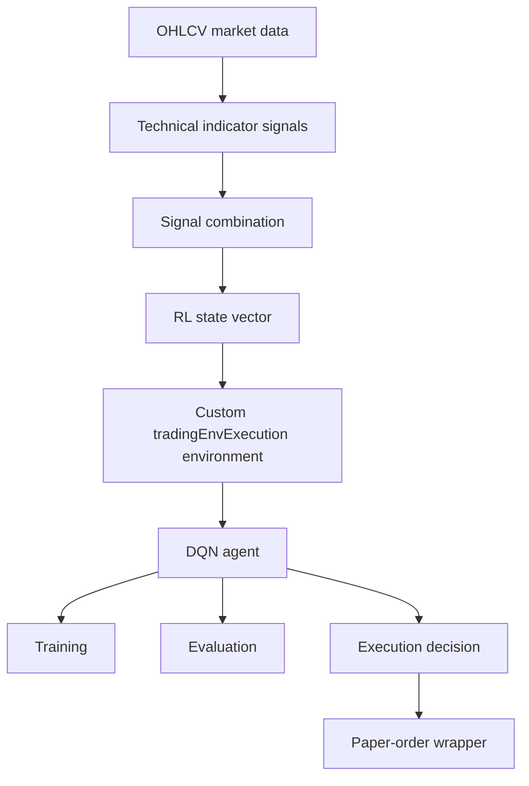

# Architecture

This project has two modes: a safe simulated-data research path and a
broker-connected paper-trading path. The simulated path is the recommended
starting point for portfolio review.

## System Flow



## Data Layer

- `src/data/generateRealisticSimData.m` creates simulated intraday OHLCV bars.
- `src/data/fetchFromIBMatlab.m` fetches broker data through IBMatlab.

The simulated path lets reviewers inspect the RL workflow without broker access.
The IBMatlab path is kept as an integration layer for paper-trading experiments.

## Signal Layer

The signal layer converts OHLCV data into directional technical signals:

- moving average crossover,
- RSI,
- MACD,
- Bollinger Bands,
- stochastic oscillator,
- volume spike signals.

`src/signal/combineSignals.m` aggregates individual signals into a single
combined signal vector used by the RL environment.

## RL Layer

`src/systemtester/tradingEnvExecution.m` defines a custom MATLAB RL environment.
The observation vector contains:

- 10 recent returns,
- the current combined signal,
- the current position.

The action space is:

- `1`: buy or go long,
- `2`: hold,
- `3`: sell or go short.

`src/systemtester/rewardFunction.m` rewards profitable directional exposure while
including transaction-cost and holding-duration penalties. `createExecutionAgent.m`
builds the DQN agent used by the training and simulation scripts.

## Execution Layer

`src/execution/buildRLObservation.m` builds an observation for live/paper use.
`src/execution/executeRLStrategy.m` maps the trained agent's action to BUY, HOLD,
or SELL behavior and calls `placeOrderIB.m`.

The execution layer is intentionally documented as paper-trading only. It should
be reviewed before connecting to any broker account.

## Public Demo Path

The recommended reviewer flow is:

```matlab
cd examples
demo_train_rl_with_sim_data
```

This script uses simulated data, trains a short demo agent, saves the generated
model artifact locally, and runs a short simulation. The generated `.mat` file is
ignored by Git.

